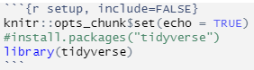

## Introduction

Rstudio is a statistical programming language used to create models and plots.

## rstudio interface

```{r interface-image}
knitr::include_graphics("images/Rstudio_IDE_screenshot.png")
```

Rstudio interface can be broken down into 4 area.

* **Top Left**: The file, you're currently working on.
  + file examples: r script, r markdown, python, and many more. 
* **Top Right**: Includes Environment, History, Connection, Git, Tutorial. 
  + Environment: This is where all your variables, data, and values are displayed. 
  + History: History of code ran.
  + Git: Github connection.
    + Diff: Display the difference between your current file and the file on github.
    + Commit, pull, push: pull up to date file from github. Commit changes on current file to github. Push your committed changes to github. 
* **Bottom Left**: Includes Console, Terminal, Render, Background Jobs.
  + Console: The location of where code chucks are ran. Runs rstudio scripts.
  + Terminal: Command terminal 
  + Render: Knitting render location.
* **Bottom Right**: Includes Files, Plot, Packages, Help, Viewer, Presentation
  + Files: Display of your files.
  + Plots: Display of your plots.
  + Packages: List of Packages.
  + Help: When help(package_or_function_name) is ran. Display information about the package or function.

## Packages
Packages are full of functions and data. Certain packages may help with visualization. To use a package, you'll have to install it and load it. You can install packages from the *Packages* tab on the bottom right. Alternatively, running **install.packages("package_name")** in the console will install your package for you. Note: Installation of package is only required once so it is ideal to comment (\#) it out in your Rmarkdown code chunks or rscript. Load the package by running **library(package_name)**. To gain addition information about your package, run **help(package_name)**.

Example: The code below (in **r setup**), display the installation and loading of tidyverse package.


## r setup

Ctrl+Alt+i = insert a new code chunk.

{r chunk-name, include=FALSE}\
\# code goes here\
\# include prevents code and results from appearing in the finished file.\
\# However, code in the chunk still runs and results can be used by other chunks.\
\# echo prevents code but results are still displayed.

First chunk of code will be used to setup rstudio packages and knitting settings.

```{r setup, include=FALSE}
knitr::opts_chunk$set(echo = TRUE)
#install.packages("tidyverse")
library(tidyverse)
```

```{r setup-image, echo=FALSE}

```

## Importing Data
Below is an example of importing csv file and setting it to the variable world_population. CSV can be found [**here**](https://www.kaggle.com/datasets/iamsouravbanerjee/world-population-dataset?resource=download).
```{r importing_Data, echo=TRUE}
world_population <- read.csv("Data/world_population.csv")
```

## Data Analysis
Standard Operations performed on world_population dataset.

* head(dataset)/tail(dataset): return the first or last parts of an object
* dim retrieve or set the dimension of an object
  + dim(x) <- value sets the dimensions of x to "value".

```{r analyzing, echo=TRUE, results='hide'}
head(world_population)
tail(world_population)
dim(world_population)
summary(world_population)
```


## Reference

